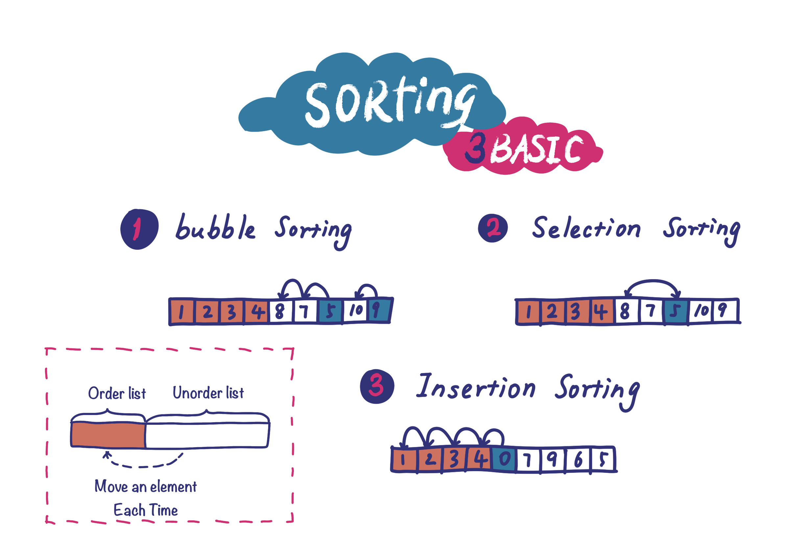

# infra-interview（基础架构面试）

Interview data structures and algorithms for infra programmers.

本仓库主要辑录 infra 程序员常见面试题目：数据结构、算法、语言（主要是 C++）。
欢迎大家在 issue 里补充你遇到的有趣的题目，然后我增加题解放到仓库里。当然，如果你直接提 PR 更好。

# video （视频讲解）

其中一些题目的背景和讲解上传到了 b 站和 youtube。

- Bilibili: https://space.bilibili.com/30933812/channel/collectiondetail?sid=1655069
- Youtbue: https://www.youtube.com/playlist?list=PLSISRu2b2N55Htp_3tUQoqMPP4EsTLGxv

# news letter（专栏）

其中一些题目的背景和讲解在我的大规模数据系统专栏《[系统日知录](https://xiaobot.net/p/system-thinking)》里。

