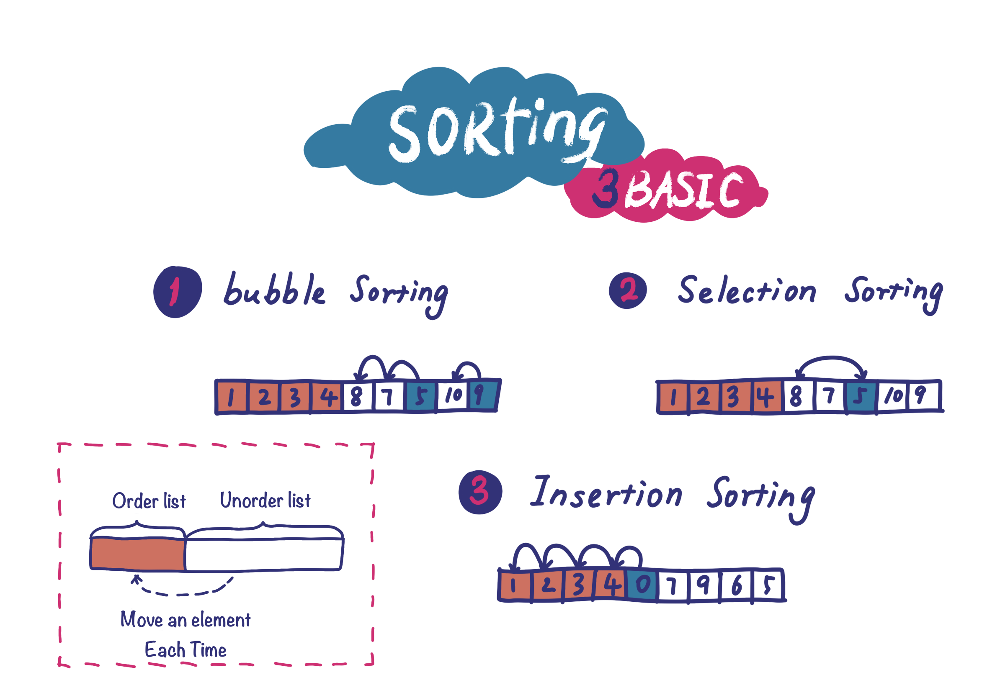
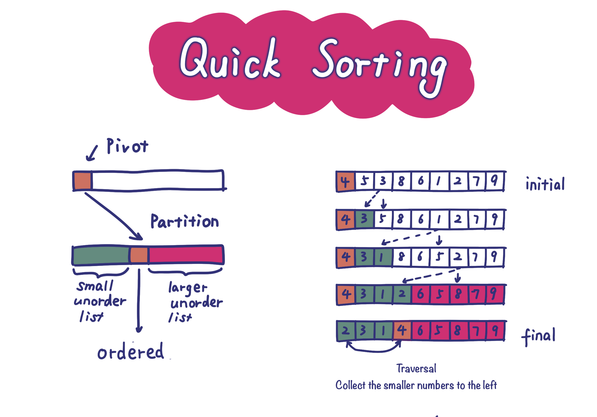
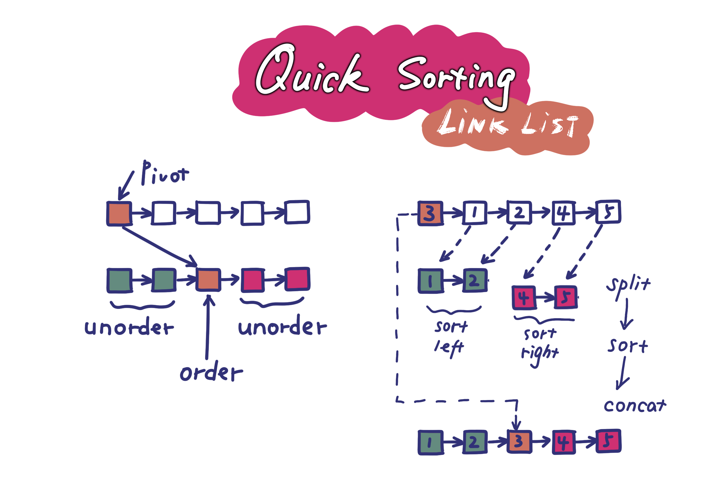
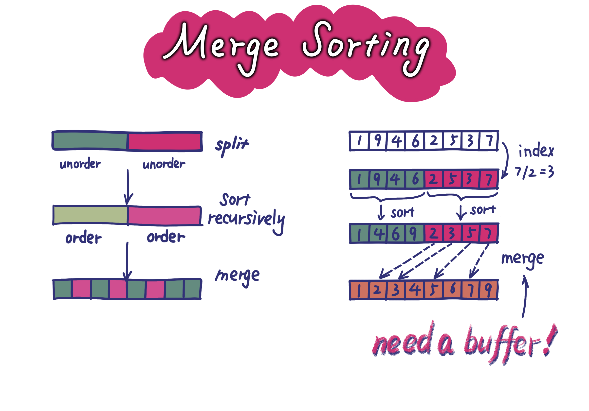
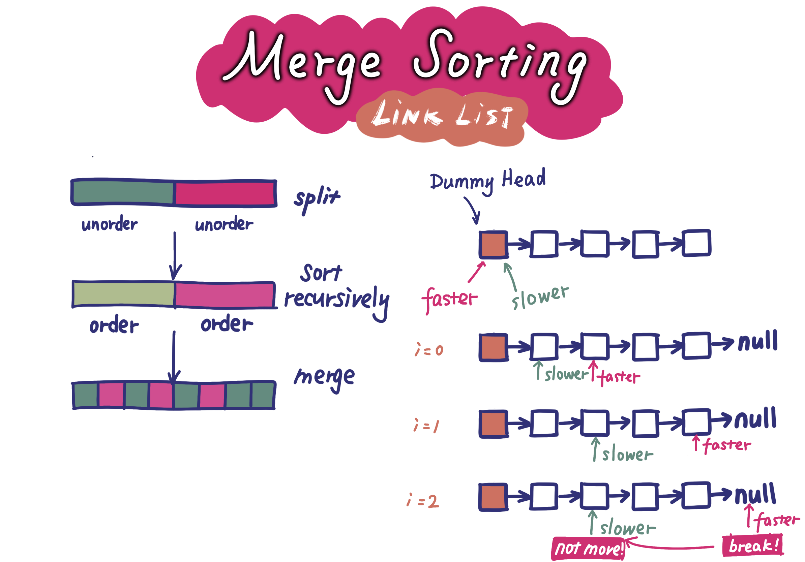
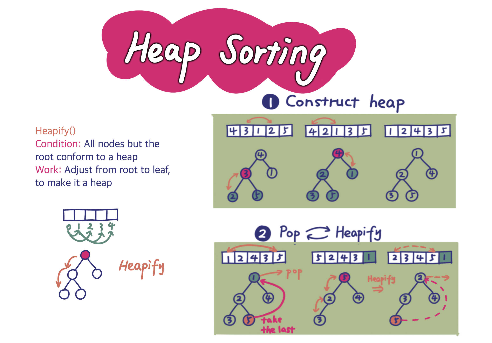

# 排序算法（sort algorighm

1. 冒泡排序（bubble sort
2. 选择排序（selection sort
3. 插入排序（insertion sort
4. 归并排序（merge sort
5. 快速排序（quick sort
6. 希尔排序（shell sort
7. 堆排序（heap sort
8. 桶排序（bucket sort

## 冒泡排序

视频：[b站](https://www.bilibili.com/video/BV1du41177iu/)，[Youtube](https://www.youtube.com/watch?v=NW8SV7gWZzQ&list=PLSISRu2b2N55Htp_3tUQoqMPP4EsTLGxv&index=2)

S-order <--bubble-- S-unorder

像冒泡一样，每次让最小的数**冒出**剩余数据集（无序）“水面”，抵达有序集。

简单总结：
1. 线性减小规模
2. 通过交换往前挪

## 选择排序

视频：[b站](https://www.bilibili.com/video/BV1ru4y1X7cs) [Youtube](https://www.youtube.com/watch?v=B_MZlU68rgU&list=PLSISRu2b2N55Htp_3tUQoqMPP4EsTLGxv&index=4)

S-order <--selection-- S-unorder

从剩余数据集（无序）中**选择**最值，放到有序集中。

简单总结：
1. 线性减小规模
2. 找到最值往前放

## 插入排序

视频：[b站](https://www.bilibili.com/video/BV1Gp4y1E7Dh) [Youtube](https://www.youtube.com/watch?v=ivGRfvUvTww&list=PLSISRu2b2N55Htp_3tUQoqMPP4EsTLGxv&index=3)

S-order <--insertion-- S-unorder

从剩余数据集（无序）中随意取一个值，然后通过比较“插入”（也可以理解为往前冒泡）到有序集中。

简单总结：
1. 线性增大规模
2. 选值放合适位置

## 基本排序小结

{[order-list], [unorder-list]}

冒泡排序、选择排序和插入排序是三种最基本的排序算法。其原理是相通的：
1. 将数组划分成前后两个子集：前面是有序集，后面是无序集
2. 三种方法都是线性的一次从无序集中搬一个元素到有序集中，只不过搬法不同：
    - 冒泡：从无序集最后逐个比较冒一个到有序集**最后**。
    - 选择：遍历无序集，选一个放到有序集**最后**。
    - 插入：从边界处选一个，插入到有序集中**合适位置**。

三种排序的复杂度都是 O(n^2)。

## 快速排序

视频：[b站](https://www.bilibili.com/video/BV1mN411i7QT) [Youtube](https://www.youtube.com/watch?v=I5Pb-i5fL44&list=PLSISRu2b2N55Htp_3tUQoqMPP4EsTLGxv&index=5)

S-left | pivot number | S-right

每次随机找一个值 x（pivot number，枢轴元素），以其为界，在数组原地：
1. 将比其小的元素拨到左边
2. 将比其大的元素拨到右边
则该值 x 一定放到了正确位置。

于是剔除该值。如果该值选择得当，便会得到两个较小子集。
相比前述三种排序算法**线性**速度减小规模，快排通过近似对半拆分，**指数**速度缩小规模。

可以看出，枢轴元素的选择会极大影响性能。

基于链表的快速排序，思想一致，主要复杂度在链表操作上。
视频：[b站](https://www.bilibili.com/video/BV1jm4y1T7YE) [Youtube](https://www.youtube.com/watch?v=REF8nBlBM7I&list=PLSISRu2b2N55Htp_3tUQoqMPP4EsTLGxv&index=6)

一些保持代码简洁的小技巧：
1. 使用栈上的空白头结点，避免是否为空的边界判断。
2. 使用尾插法减少一个 tail 指针变量。
3. 递归函数将新的链表头结点返回。

一些改进点：
1. 可以在递归时同时返回第一个节点和最后一个节点指针，就可以避免拼接的时候对 smaller 链表的遍历。
2. 可以在拼接的时候使用 dummy 头结点，就可以避免对 smaller 空链表的判断。

## 归并排序

视频：[b站](https://www.bilibili.com/video/BV1194y1s75T) [Youtube](https://www.youtube.com/watch?v=mWlsMiwDfyM&list=PLSISRu2b2N55Htp_3tUQoqMPP4EsTLGxv&index=7)

S-half-left | S-half-right

归并排序过程：
1. 将原数组从中间一分为二
2. 对左右子数组分别递归排序
3. 合并左右子数组

可以看出，思路和快排非常类似，都是分成两部分然后递归。

不同的是，不会选择枢轴元素并将所有元素左右分层（相当于分了两个桶）。也正因为如此，最后需要有个合并过程。且，合并的时候需要一个额外的 buffer。如果不用 buffer 进行原地（ in-place ）合并也不是不可以，只是算法复杂度难以保持 O(nlogn)。

但当然，好处就是，由于每次我们都会保证从中间拆分数组，可以保证时间复杂度稳定的为：O(nlogn)。代价就是，由于合并时需要借助 buffer，因此空间复杂度为 O(n)，而快排空间复杂度为 O(1)。

基于链表的归并算法，思想和数组归并类似，主要难点在于拆分的时候边角情况的处理。很容易非法访问和爆栈（stack overflow）。

视频：[b站](https://www.bilibili.com/video/BV18z4y157LT) [Youtube](https://www.youtube.com/watch?v=n4vGM1h245k&list=PLSISRu2b2N55Htp_3tUQoqMPP4EsTLGxv&index=8)

可以有两种拆分的方法：
1. 2 passes：第一遍求长度，利用半长找到分界点。
2. 1 pass：快慢指针，快指针每次走两步，慢指针每次走一步

技巧：只需要考虑 2 node 和 3 node 的链表拆分即可。

## 堆排序

视频：[b站](https://www.bilibili.com/video/BV1DV411w7pi) [Youtube](https://www.youtube.com/watch?v=pMvOP9Pq-Sc&list=PLSISRu2b2N55Htp_3tUQoqMPP4EsTLGxv&index=9)

关键是实现一个“堆化”（heapify）函数。
该函数的工作是：在一个除了根元素其他元素都符合堆的性质的情况下，自根向叶的调整，使之完全符合堆的性质。
由于调整次数最多是一个堆的深度，因此复杂度为 O(nlogn)。

则堆排序可以分为两个步骤：
1. 建堆。自底向上，调用堆化函数调整每个子树，到根子树时，建堆完成。
2. 排序。对于一个堆，将堆顶元素弹出，从最后拿一个元素到堆顶，重新调用堆函数进行调整。循环往复直到堆变空。

注意：
1. 我们在实现的时候，通常会使用数组模拟满二叉树，进而使用满二叉树表示堆。
2. 由于每次弹出后会将元素放最后，因此如果是升序排序，需要构建大顶堆。

可以看出，和三种基本排序相同的是，堆排序也是把数组划分成了两个子集。左边无序子集，右边有序子集，但不同的是，堆排序将无序子集组织成了堆的形式，使得每次移动的复杂度是 O(logn)，而不是 O(n)。
